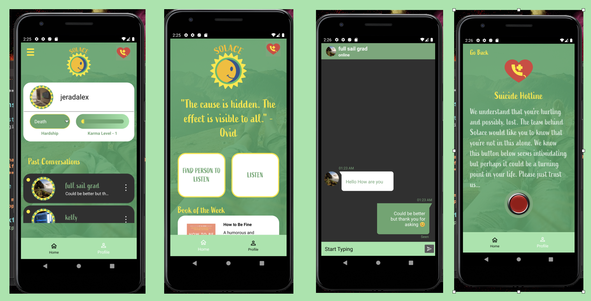
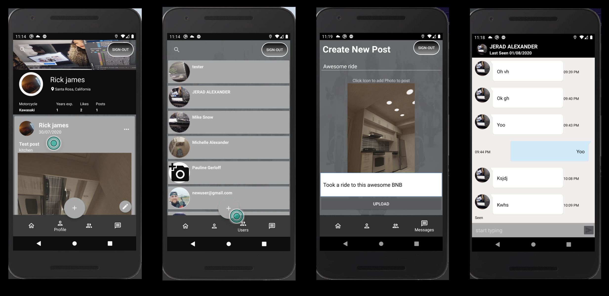
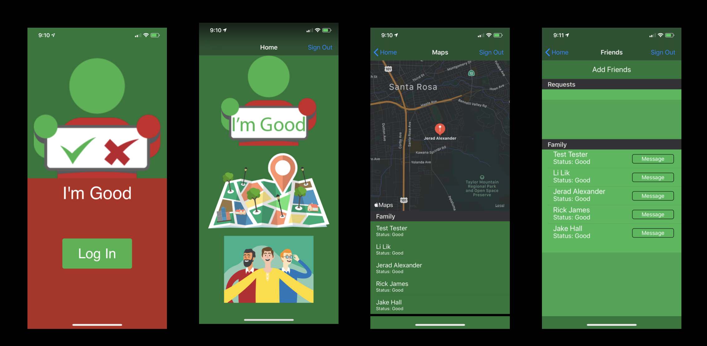
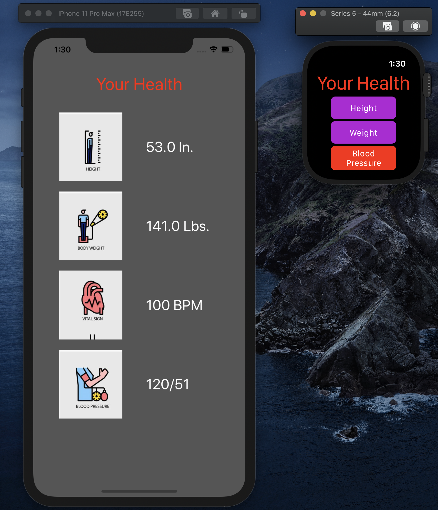
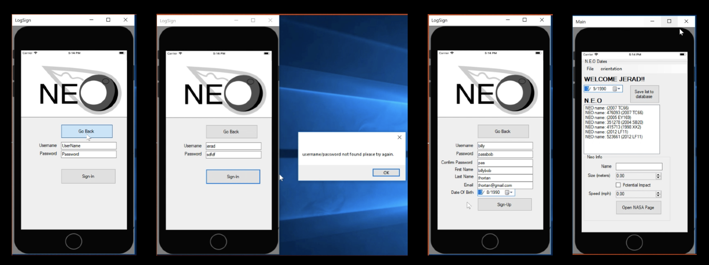

# Portfolio

## Solace Project

### Basic Description

**Android and IOS**

Self-Help application with chat as its main feature

[Walkthrough](https://youtu.be/oMMe6TN9_VQ)

### Screenshots

## Rubber Side Down

### Basic Description

**Android** 

Social Media application for motorcycle riders

### Screenshots

## I'm Good

### Basic Description

**IOS**

Social Check-in Application where users can get status and keep in touch with their support system

### Screenshots

## My Health

### Basic Description

**Apple Watch/Companion app**

Watch application where user can update Apples health App and companion app with important health measurements

### Screenshots

## NEO

### Basic Description

**Window Forms**

Application where user can search for data on near earth objects on specific dates.

### Screenshots

 
